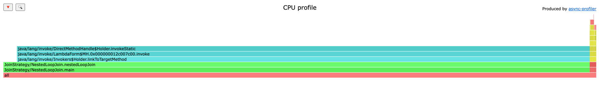
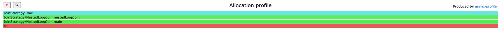
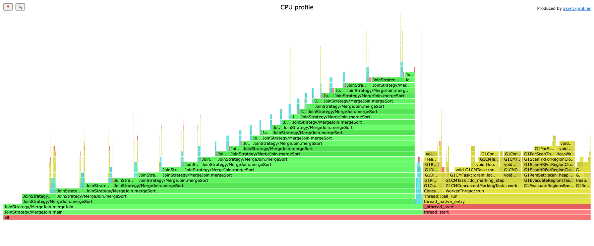
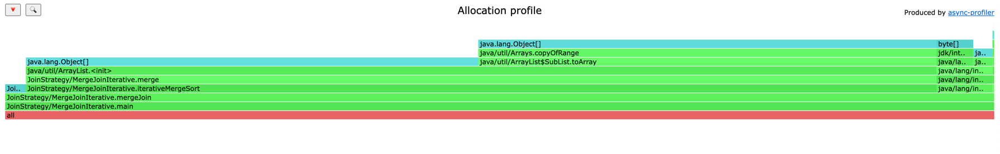
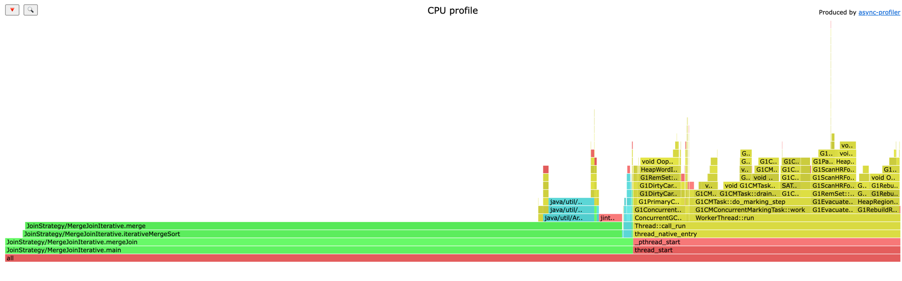
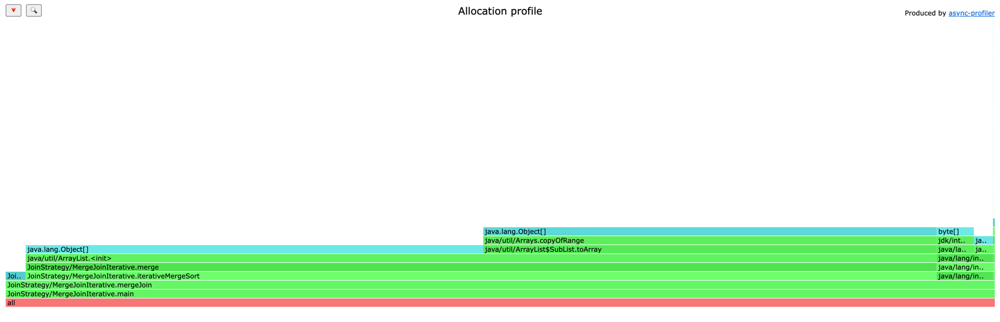
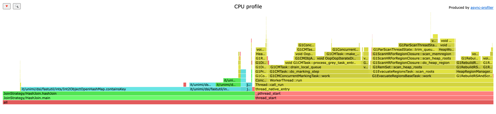
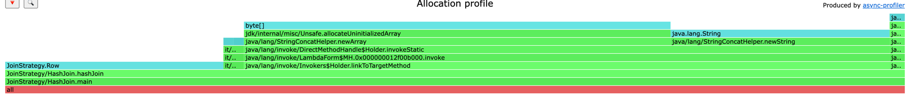

# JoinStrategy-lab1
JoinStrategy-lab1 

В качестве алгоритмов были стратегии соединения.
- NestedLoopJoin
- MergeSortJoin
- MergeSortJoin (без рекурсии)
- HashJoin

Стратегии соединения используются в базах данных для объединения двух или более таблиц на основе определенных условий. Эти стратегии позволяют эффективно выполнять операции соединения, обеспечивая оптимальное использование ресурсов и минимизацию времени выполнения запросов. Рассмотрим основные стратегии соединения и их применение:

# 1. Nested Loop Join (Вложенные циклы) 

Этот метод соединения использует вложенные циклы для сравнения каждой строки одной таблицы с каждой строкой другой таблицы. Он прост в реализации, но может быть неэффективен для больших таблиц из-за высокой временной сложности (O(n*m), где n и m — количество строк в таблицах).  

   Table size| 1000  | 10000 | 100000 | 1000000     | 10000000    |
   --- |-------|-------|--------|-------------|-------------|
   time, ms | 1,916 | 375,304   | 56442,535 | over 20 min | over 20 min | 
   err, ms ±| 0,011 | 6,723 | 2290,589 | -           | -           |   

### CPU flamegraph. 

### Allocation flamegraph.  
  

Квадратичный рост времени выполнения,  нет вызовов сложных операций,  память выделяется,  только на инициализацию строк. 
# 2. MergeSortJoin 
Это стратегия соединения таблиц, которая использует алгоритм сортировки слиянием (merge sort) для предварительной сортировки таблиц по ключу, а затем выполняет соединение отсортированных таблиц. Эта стратегия эффективна для больших таблиц и обеспечивает хорошую производительность за счет использования сортировки слиянием, которая имеет временную сложность O(n log n).  

   Table size| 1000  | 10000 | 100000 | 1000000  | 10000000  |
   --- |-------|-------|--------|----------|-----------|
   time, ms | 0,238 | 3,484 | 58,685 | 1081,339 | 14341,255 | 
   err, ms ±| 0,011 | 0,043 | 1,221  | 32,951   | 604,950   |  

### CPU flamegraph. 

### Allocation flamegraph.  
. 

Сравним с реализацией без рекусии.

   Table size| 1000   | 10000 | 100000 | 1000000  | 10000000  |
   --- |--------|-----|--------|----------|-----------|
   time, ms | 0,245 | 3,550 | 69,661 | 1500,657 | 19640,96 | 
   err, ms ±| 0,002  | 0,056 | 2,979  | 65,519   | 913,336   |  

### CPU flamegraph.  
   

### Allocation flamegraph.  

Nlog(N) времени выполнения. В первом случае видим рекурсивные вызовы метода mergeSort, т.к. используется рекурсиваная сортировака слиянием, в варианте без рекурсии идет линейный вызов метода merge в цикле, поэтому крафик ровный без скачков. В обоих случаях работет сборщик мусора. Графики аллокации схожи.  

# 3. HashJoin 
Стратегия соединения таблиц, которая использует хеш-таблицу для ускорения процесса соединения. В этой стратегии одна из таблиц (обычно меньшая) загружается в хеш-таблицу, где ключи являются идентификаторами строк. Затем строки другой таблицы проверяются на наличие совпадений в хеш-таблице. Это позволяет эффективно выполнять соединение, особенно для больших таблиц.  
CPU flamegraph.

   Table size| 1000  | 10000 | 100000 | 1000000  | 10000000  |
   --- |-------|-------|--------|----------|-----------|
   time, ms | 0,039 | 0,757 | 14,773 | 302,973  | 3956,381  | 
   err, ms ±| 0,001 | 0,010 | 0,292  | 34,977    | 324,529   |         

### CPU flamegraph.

### Allocation flamegraph.  

Линейный рост времени выполнения. Большую часть занием проверка наличи я ключа в хеш таблице, так же идет сборка мусора. В отличе от остальных методов выделяется память для хеш таблицы.  

# Вывод  
   Type| 1000  | 10000 | 100000 | 1000000  | 10000000  |
   --- |-------|-------|--------|----------|-----------|
   Hash Join | 0,039 | 0,757 | 14,773 | 302,973  | 3956,381  | 
   MergeSort, ms | 0,238 | 3,484 | 58,685 | 1081,339 | 14341,255 | 
   MergeSort(без рекурсии) | 0,245 | 3,550 | 69,661 | 1500,657 | 19640,96 |
   NestedLoop, ms | 1,916 | 375,304   | 56442,535 | over 20 min | over 20 min | 

 
В ходе работы были исследованы и сравнены различные стратегии соединения таблиц: Nested Loop Join, Merge Sort Join (с рекурсией и без рекурсии), и Hash Join. Были построены flamegraph для CPU и аллокации памяти, которые показали различия методов.
Результаты показали, что каждая стратегия имеет свои преимущества и недостатки в зависимости от размера таблиц и требований к производительности.  
В итоге, Hash Join показал наилучшие результаты по времени выполнения и эффективности для больших таблиц.